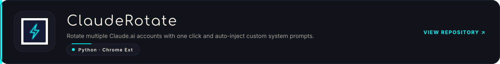

  

### What I Build

I design and engineer local-first desktop software and applied AI tools that run directly on your machine. My focus is on high-utility desktop applications, multi-model AI orchestration, document intelligence, and productivity operating systems that eliminate browser-tab fatigue and protect user privacy.

---

### Featured Systems

<table width="100%" style="border-collapse: collapse; border: none;">
  <tr style="border: none;">
    <td width="50%" style="border: none; padding: 6px;">
      
    </td>
    <td width="50%" style="border: none; padding: 6px;">
      
    </td>
  </tr>
  <tr style="border: none;">
    <td width="50%" style="border: none; padding: 6px;">
      
    </td>
    <td width="50%" style="border: none; padding: 6px;">
      
    </td>
  </tr>
</table>

  

---

### Engineering Focus

- **Local-First & Zero Cloud Leak**: Architecting applications where data stays on-device by default using SQLite FTS5, local vector indices, and PKCE auth.
- **Model Orchestration & Synthesizers**: Uniting disparate frontier LLMs (Claude, GPT, Gemini, DeepSeek, Grok) into unified desktop runtimes and council deliberation pipelines.
- **Native Desktop Performance**: Building responsive desktop tools with instant startup, minimal memory footprints, and tactile keyboard workflows.

---

### Stack & Tools

  
  
  
  
  
  
  
  
  
  

---

### Connect

  
  &nbsp;
  
  &nbsp;
  
  &nbsp;
  

