<p align="center">
  
</p>

<table align="center" width="100%" style="border: none; background: transparent;">
  <tr style="border: none; background: transparent;">
    <td width="25%" align="center" valign="middle" style="border: none; background: transparent;">
      <a href="https://github.com/devanshd07o">
        
      </a>
      <br />
      
    </td>
    <td width="75%" valign="middle" style="border: none; background: transparent;">
      <div style="background-color: #030712; border: 1px solid #1e293b; border-left: 4px solid #00f0ff; border-radius: 8px; padding: 14px 18px; font-family: 'Courier New', monospace;">
        <span style="color: #64748b;">┌──(</span><span style="color: #00f0ff;">devansh㉿neural-core</span><span style="color: #64748b;">)-[</span><span style="color: #cbd5e1;">~/workspace</span><span style="color: #64748b;">]</span><br />
        <span style="color: #64748b;">└─$</span> <span style="color: #7ee787;">./boot_sequence.sh</span> <span style="color: #f1f5f9;">--profile="elite-engineer"</span><br />
        <span style="color: #00f0ff;">▸ IDENTITY</span>&nbsp;&nbsp;&nbsp;&nbsp;&nbsp;&nbsp;: <strong style="color: #f8fafc;">Devansh Dubey (देवांश दुबे)</strong><br />
        <span style="color: #7928ca;">▸ ARCHETYPE</span>&nbsp;&nbsp;&nbsp;&nbsp;&nbsp;: <span style="color: #cbd5e1;">Full-Stack Architect &amp; Autonomous AI Systems Engineer</span><br />
        <span style="color: #ff007a;">▸ ACTIVE LAB</span>&nbsp;&nbsp;&nbsp;&nbsp;: <span style="color: #cbd5e1;">Engineering Multi-Agent Tool-Calling Swarms &amp; Low-Latency APIs</span><br />
        <span style="color: #00ff66;">▸ STATUS</span>&nbsp;&nbsp;&nbsp;&nbsp;&nbsp;&nbsp;&nbsp;&nbsp;: <span style="color: #00ff66;">🟢 SYSTEM HEALTH: 100% // READY FOR DEPLOYMENT</span>
      </div>
    </td>
  </tr>
</table>

<p align="center">
  
  &nbsp;
  
  &nbsp;
  
</p>

---

### 🕹️ Interactive System Console

<details open>
<summary><b><code>[CMD: 01] ▶ cat /etc/manifesto.conf</code></b></summary>
<br />

```bash
#!/bin/cat
# ==============================================================================
# DEVANSH DUBEY // CORE ENGINEERING PROTOCOL
# ==============================================================================

[01. PARADIGM]
  "True engineering is measured in sub-100ms latency boundaries, deterministic
   reliability, and zero decorative fluff."

[02. ARCHITECTURE FOCUS]
  • AI Systems       : Agentic Tooling, LLM Execution Graphs, Memory Graphs, Hybrid RAG
  • High-Throughput  : Reactive Event Busses, Asynchronous Concurrency, Low-Latency DBs
  • Tactile Web      : Zero Layout Shift (CLS: 0), Tactile Micro-Interactions, Pixel-Precision

[03. CORE MOTTO]
  "Code that scales quietly. Systems that never crash loudly."
```
</details>

<details open>
<summary><b><code>[CMD: 02] ▶ sysinfo --architecture --matrix</code></b></summary>
<br />

<p align="center">
  
</p>

</details>

<details open>
<summary><b><code>[CMD: 03] ▶ ls -la ./classified-deployments/</code></b></summary>
<br />

| Flagship Initiative | Architectural Focus | Primary Tech Stack | Status Indicator |
| :--- | :--- | :--- | :---: |
| **Autonomous Multi-Agent Swarm** | Self-healing tool-calling coordinator with sandboxed runtime & vector graph | `Python` `LangGraph` `FastAPI` `Qdrant` | `🟢 PRODUCTION` |
| **Ultra-Low Latency RAG Mesh** | Hybrid dense-sparse neural search with localized reciprocal reranking | `TypeScript` `pgvector` `Next.js 15` `Docker` | `⚡ ACTIVE R&D` |
| **High-Throughput Distributed Gateway**| Event-driven rate-limited reverse proxy engine with Prometheus telemetry | `Go` `Redis Streams` `PostgreSQL` `Prometheus`| `🧪 EXPERIMENTAL` |
| **Spatial 3D & Kinetic UI Surface** | Zero-latency developer cockpit with Three.js shaders & keyboard accelerators | `React 19` `TailwindCSS` `Three.js` `Framer` | `🟢 SHIPPED` |

</details>

---

### 🧠 Curated Weaponry & Stack Ecosystem

<table>
  <tr>
    <td width="50%" valign="top">
      <h4>⚡ Artificial Intelligence &amp; Autonomous Agents</h4>
      <p>
        
        
        
        
        
        
        
      </p>
    </td>
    <td width="50%" valign="top">
      <h4>⚡ High-Throughput Backend &amp; Databases</h4>
      <p>
        
        
        
        
        
        
        
      </p>
    </td>
  </tr>
  <tr>
    <td width="50%" valign="top">
      <h4>🎨 Frontend &amp; Interactive Experiences</h4>
      <p>
        
        
        
        
        
        
      </p>
    </td>
    <td width="50%" valign="top">
      <h4>☁️ Cloud Orchestration &amp; Infrastructure</h4>
      <p>
        
        
        
        
        
        
      </p>
    </td>
  </tr>
</table>

---

### 📊 Real-Time Mainframe Telemetry

<p align="center">
  
  
</p>

<p align="center">
  
</p>

---

### 👾 Quantum Velocity (3D Contribution Snake)

<p align="center">
  <picture>
    <source media="(prefers-color-scheme: dark)" srcset="https://raw.githubusercontent.com/devanshd07o/devanshd07o/output/github-contribution-grid-snake-dark.svg">
    <source media="(prefers-color-scheme: light)" srcset="https://raw.githubusercontent.com/devanshd07o/devanshd07o/output/github-contribution-grid-snake.svg">
    
  </picture>
</p>

---

### 📡 Direct Neural Transmission

<p align="center">
  <a href="https://linkedin.com/in/devanshd07o" target="_blank">
    
  </a>
  &nbsp;
  <a href="https://x.com/devanshd07o" target="_blank">
    
  </a>
  &nbsp;
  <a href="mailto:devanshd07o@gmail.com">
    
  </a>
  &nbsp;
  <a href="https://github.com/devanshd07o">
    
  </a>
</p>

<p align="center">
  
</p>
